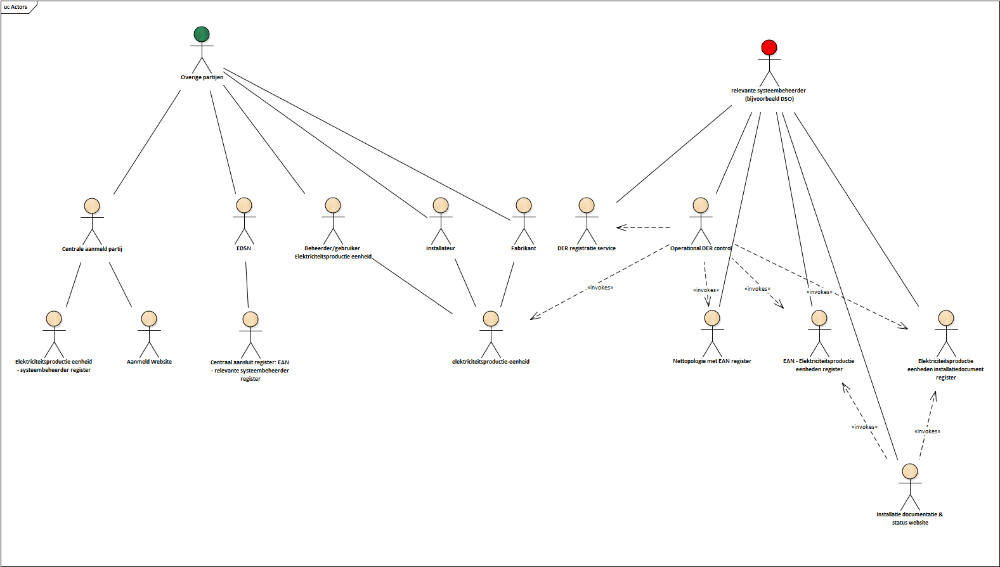
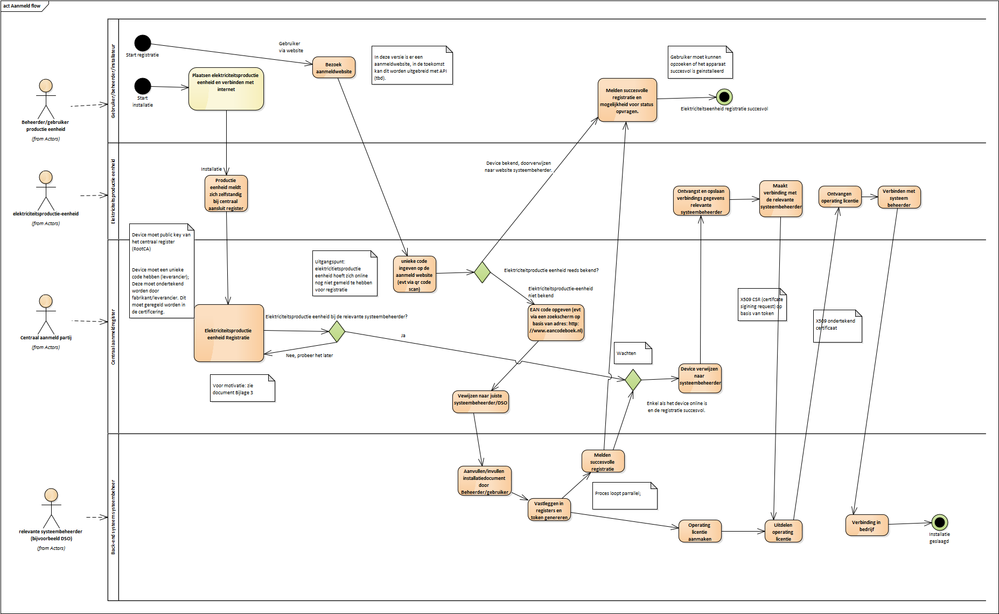
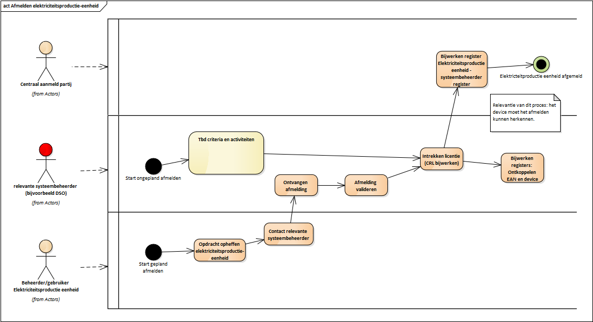
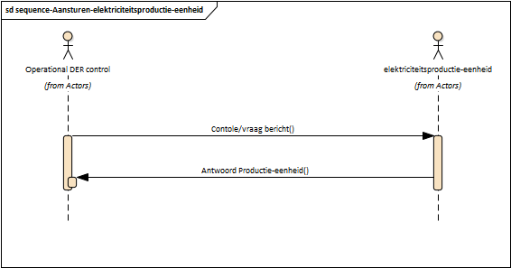
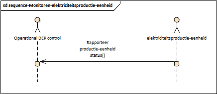

# 5.1 Gerelateerde Business- en Systeemprocessen

Om een goede interfacespecificatie te maken is het handig om een overzicht te maken van de verschillende actors en de verschillende processen. Op basis van deze processen/activiteiten en requirements kan worden achterhaald welke informatie moet worden uitgewisseld. Let er op dat de getekende processen verder gaan dan de interface met de elektriciteitsproductie-eenheid. Dit om er zeker van te zijn dat er een werkbaar proces kan ontstaan met de gespecifieerde interface. Dit betekent niet dat hiermee de \(verdere\)processen zijn gedefinieerd. Het dient ter validatie. De tekenwijze is gebaseerd op UML \(niet helemaal volgens de UML specs\).

## Actors

Tot nu toe is er in de afbeeldingen onderscheid gemaakt tussen DSO of relevante netbeheerder \(rood\) en alle overige partijen \(groen\). Het onderstaande figuur geeft een completer overzicht van de verschillende actoren en aan welke categorie ze kunnen worden gerelateerd \(DSO rood, of overig groen\).  [https://netbeheernederland.gitbooks.io/interfacespecificatie-elektriciteit/content/assets/Actors.png](https://netbeheernederland.gitbooks.io/interfacespecificatie-elektriciteit/content/assets/Actors.png)

## Aanmeldproces

Onderstaand aanmeldproces is opgetekend om te definiëren welke communicatie moet worden opgebouwd vanuit de interface, hoe en wanneer beveiligd in het proces en met welke informatie. Dit is voldoende voor de interfacespecificatie waarbij het definitieve proces officieel nog moet worden vastgesteld.  [https://netbeheernederland.gitbooks.io/interfacespecificatie-elektriciteit/content/assets/Aanmeld-flow.png](https://netbeheernederland.gitbooks.io/interfacespecificatie-elektriciteit/content/assets/Aanmeld-flow.png)

Het bovenstaande proces geeft duidelijk weer welke eisen er minimaal moeten gelden aan de interfacespecficatie van de elektriciteitsproducie-eenheid. De interface moet: 1. zich zelfstandig verbinden en aanmelden via een centraal adres \(URL\). Dit adres verwijst uiteindelijk naar een centraal aansluitregister. In de opbouwfase van het systeem kan dit adres ook naar een tijdelijk aansluit register verwijzen. 2. verbonden blijven tot en met de ontvangst van \(nieuwe\)verbindinggegevens van de relevante systeembeheerder, inclusief een token voor veilige verbindingsopbouw en al deze informatie opslaan. 3. de verbinding met het centraal aansluitregister verbreken. 4. op basis van de nieuwe verbindinggegevens verbinden met de relevante systeembeheerder. Hierbij wordt een beveiligde verbinding gebruikt. 5. een operating license kunnen ontvangen van de relevante systeembeheerder en deze opslaan. 6. na opslag van de operating license de verbinding verbreken ter afsluiting van de installatie en registratieve processen. 7. met een operating license zelfstandig verbinden met van de relevante systeembeheerder zoals beschreven bij paragraaf "Operationele aansturing".

Voor specifieke en detaileisen zie ook hoofdstukken "Message specification", "Conformiteitseisen" en "Registratieprocotol".

## Afmeldproces

Onderstaand afmeldproces is opgetekend om te definiëren welke communicatie moet plaatsvinden met de interface, hoe en wanneer beveiligd in het proces en met welke informatie. Dit is voldoende voor de interfacespecificatie waarbij het definitieve proces officieel nog moet worden vastgesteld.

 [https://netbeheernederland.gitbooks.io/interfacespecificatie-elektriciteit/content/assets/Afmelden-elektriciteitsproductie-eenheid.png](https://netbeheernederland.gitbooks.io/interfacespecificatie-elektriciteit/content/assets/Afmelden-elektriciteitsproductie-eenheid.png)

Het bovenstaande proces geeft weer dat er voor het afmelden maar beperkte eisen gelden aan de interface, namelijk dat de interface herkent dat door het intrekken van het certificaat, en daardoor een certificaatfout, opnieuw de registratie doorlopen moet worden. Zie hiervoor ook [gedrag productie-eenheden](https://netbeheernederland.gitbooks.io/interfacespecificatie-elektriciteit/content/assets/Gedrag-productie-eenheden.png).

## Operationele aansturing

Het momentele standpunt is dat het mechanisme van IEC 61850-90-10 \(scheduling\) kan worden toegepast naar voorbeeld van de Duitse FNN Steuerbox. Scheduling is essentieel door het autonome gedrag van de elektriciteitproductie-eenheid, waardoor de totaal gevraagde functionele beschikbaarheid toeneemt; ook bij communicatieproblemen. Echter deze standaard is vrij nieuw \(relatief onbeproefd\) en is een extra complicatie om in software om te zetten voor marktpartijen. Er is dus een referentie-implementatie noodzakelijk om het risico voor de markt-implementatie van deze functionaliteit te kunnen realiseren. Er is ook speciale aandacht vereist op het testen van conformiteit van scheduling. Desalniettemin, is de werking in de IEC 61850-90-10 standaard duidelijk beschreven en kan het testen worden gerealiseerd door zeer korte en verschillende schedules met verschillende prioriteit te plannen en **het gedrag** te controleren. Indien een referentie-implementatie deze functionaliteit biedt, zal scheduling als eis kunnen worden gesteld. Tot die tijd zal een tijdelijke informatie-uitwisseling op de interface zal het liefst IEC 61850-90-10 conform zijn, maar minimaal in opéénvolgende versies groeien naar het volledige IEC 61850-90-10 mechanisme.

Naast het monitoring van de elektriciteitsproductie-eenheid is het ook wenselijk om te sturen, parameters te versturen en ad-hoc vragen te stellen aan de elektriciteitsproductie-eenheid. Dit zal een request-response mechanisme zijn.



Klasse 1 interface \(voorzien in RfG Type A\)

* Productie vermogen reductie naar 0 aanzetten
* Productie vermogen reductie opheffen
* Bijwerken schema's voor autonome gedrag
* Opvragen interface versie \(dit document\)
* Opvragen interface \(software\) versie elektriciteitsproductie eenheid

Klasse 2 interface \(voorzien in RfG Type B\), aanvullend aan klasse 1:

* Opvragen regelbaar werkelijk/blind vermogen
* Werkzame vermogen te verminderen/uitzetten
* Werkzame vermogen te vermeerderen/aanzetten
* Melden van terugregeling productie eenheid aan systeembeheerder

De schema's zijn vrij de defineren door de systeembeheerder. De prioriteiten zouden er zo uit kunnen zien \(voorbeeld\):

| Prio | Gebruik | Commentaar |
| :--- | :--- | :--- |
| 250 | Emergency | Voor noodgevallen |
| 210 | Opstart schema | Wordt getriggerd bij het opstarten. |
| 200 | Schema per dag | Wordt actief bijgewerkt door systeembeheerder |
| 100 | Baseline op basis van lokale netconfiguratie | vast patroon om congestie te voorkomen |
| 50 | Markt | kan gebruikt worden voor handel op de markt |
| 0 | Geen reductie | Elektriciteitsproductie eenheid mag 100% leveren |

## Rapportage/monitoring

Hoog over zal de rapportagefunctie een publisch-subscribe mechanisme zijn waarbij de elektriciteitsproductie-eenheid zelfstandig zijn eigen status rapporteert. De exacte informatie die uitgewisseld moet worden is per type verschillend en zal in de detailspecificatie uitgewerkt moeten worden. Over de updatefrequentie schrijft de [Entso-e KORR](https://electricity.network-codes.eu/Documents/Network%20codes%20documents/Implementation/sys/1.a.180227_KORRR_final.pdf) in artikel 10.5 "Each TSO shall define the refresh rate for the real-time data exchanges in its control area. It shall not be longer than 1 minute".

 Near-Real-time informatie kan gebruikt worden voor storingen en prognoses.

Klasse 1 \(voorzien in RfG Type A\):

* Tijdsynchronisatie fout melding/status
* Keepalive om de verbinding open te houden1
* Werkelijk momententaan vermogen \(MW\) wat terug geleverd wordt door de elektriciteitsproductie eenheid

Update frequentie monitoring signalen \(configureerbaar door systeembeheerder\): 15 minuten

Klasse 2 \(voorzien in RfG Type B\), aanvullend aan klasse 1:

* Minimal Power \(P\) during measurement interval 15 minuten
* Maximal Power \(P\) during measurement interval 15 minuten
* Average Power \(P\) in each 24 hours
* Momentane frequentie
* Momentane spanning
* Minimale/maximale spanning/frequentie van een piek/dal met tijdstip. 8 waarden totdat deze worden uitgelezen.
* Status elektriciteitsproductie eenheid \(is hij instaat om te acteren op bestuur commando's van de systeembeheerder\)
* Werkelijk blindvermogen \(MVar\) wat terug geleverd wordt door de elektriciteitsproductie eenheid

Updatefrequentie monitoring signalen \(configureerbaar door systeembeheerder\): 30 seconden

1 Een elektriciteitproductie-eenheid is in basis verantwoordelijk voor de verbinding met de relevante systeembeheerder. Om deze verbinding actief te maken en te houden en om ervoor te zorgen dat het dataverbruik beperkt blijft zijn er een aantal aandachtspunten:

* Ondersteuning voor TLS session resumption.

  ```text
    Resumption is niet noodzakelijk na een stroomuitval, maar gedurende de dag wel.
  ```

* Keepalive tijd van een verbinding wordt door de elektriciteitproductie-eenheid bepaald.

  ```text
    Hierbij moet het apparaat zelf bepalen wat de optimale keepalive tijd is.
    Keepalives zijn in basis de standaard keepalives in tcp of tls.
  ```

