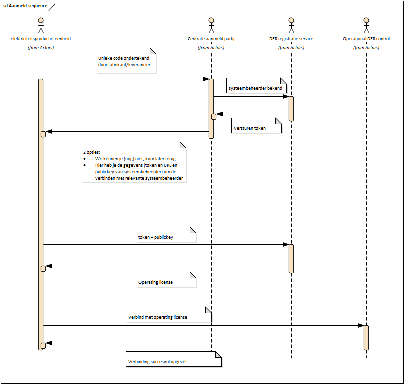

# 5.4 Registratie protocol

Device \(elektriciteitsproductie eenheid\) wordt geleverd met:

* ROOT CA Public key centrale aanmeld partij.
* Connectiegegevens centrale aanmeld partij server.
* Uniek device code bestaande uit
  * Fabrikant/type code zoals bij conformiteitstest registreerd.
  * Een uniek serienummer.
  * Ondertekend door een fabrikant root ca waarbij de public key bij de conformiteitstest is geregistreerd.

Aanmeld sequence diagram ter illustratie van onderstaand proces. 

**Interface centrale aanmeld partij:**

* Device verbind met centrale aanmeld partij \(https request, waarschijnlijk json/soap\)
* Mislukt de verbinding dan:
  * Verbind het apparaat automatisch opnieuw met een steeds stijgend interval
  * Bijvoorbeeld 'direct opnieuw', 'na 30seconde nog eens' '5 minuten' 'kwartier'

      'uur', 'dag', 'week', 'maand', na een powercyle of optioneel human input begint het device weer bij 'direct opnieuw'.

      verder dan een maand stijgt het niet.
* centrale aanmeld partij stuurt 2 mogelijke responses:
  1. Device is onbekend

     Device krijg response 'reconnect in x seconds'

  2. Device is bekend

     Device krijgt response met daarin:

     * Ip/poort of dns van registratieserver relevante systeembeheerder.
     * Public key van relevante systeembeheerder.
     * Token voor licentieaanvraag.

Device gaat verbinden met de registratieserver van de relevante systeembeheerder \(https request, waarschijnlijk json/soap\):

Device maakt een certificaat signing request met daarin:

* CN is het unieke device code.
* Token die geleverd is door relevante systeembeheerder \(doorgestuurd vanaf centrale aanmeld partij\).

CSR wordt gestuurd naar relevante systeembeheerder naar de ip/poort die eerder gekregen is.

* Beveiliging hier is een certificaat ondertekend door Sub CA onder de centrale aanmeld partij CA.

Response daarop is:

* Device onbekend \(certificaatfout of melding onbekend\), waarop het device terug moet vallen naar centrale aanmeld partij met 5 minuten pause.
* Mislukt de verbinding dan:
  * Verbind het apparaat automatisch opnieuw met een steeds stijgend interval
  * Bijvoorbeeld 'direct opnieuw', 'na 30seconde nog eens' '5 minuten' 'kwartier'

      'uur', 'dag', 'week', 'maand' waarna een device terugvalt naar centrale aanmeld partij.
* Licentie in de vorm van een ondertekende CSR en een ip/poort/dns om mee te verbinden met dat certifcaat.

-- Device is nu succesvol geregistreerd en kan verbinden met de relevante systeembeheerder.

Bij verbinden met de service zijn 3 dingen mogelijk:

* Device onbekend \(certificaatfout\), waarop het device terug moet vallen naar de registratieserver van de DER registratie service.
* Mislukt de verbinding dan:
  * Verbind het apparaat automatisch opnieuw met DER registratie service een steeds stijgend interval
  * Bijvoorbeeld 'direct opnieuw', 'na 30seconde nog eens' '5 minuten' 'kwartier'

      'uur', 'dag' waarna een device terugvalt naar de registratieserver \(tijd is korter dan bij registratie, zodat devices sneller nieuw registeren\).
* Beveiliging hier is een certificaat ondertekend door Sub CA onder de centrale aanmeld partij CA.
* Succesvolle verbinding waarna het protocol voor uitwisselen meetdata start.
  * Hierin komt een commando voor verbind naar andere server \(met ip/poort/dns\)

**Rationale:**

* Bij een ddos/storing bij centrale aanmeld partij gaan alleen nieuwe registraties mis.
* Bij een ddos/storing bij de registratieserver van de relevante systeembeheerder kan deze vrij snel gewisseld worden voor nieuwe registraties.

  voor ouder registraties zal dit een rondgang bij centrale aanmeld partij betekenen wat erg lang kan duren, dus de oude server weghalen is onhandig.

* De 'service' bij de systeembeheerder is vrij eenvoudig in veelvoud uit te voeren wat ook sterk aan te raden is.
* Bij een software update van een inverter met nieuwe crypto waardoor de verbinding met de service wegvalt gaat het device automatisch 

  naar de registratieserver waar een nieuw certificaat met de nieuwe crypto gemaakt wordt.

* Het deel voor 'service' bevat niet meer dan wat er nodig is voor een tls verbinding, zodat alle data hier vrij is voor het protocol.
* Verhuizen van device loopt effectief:
  * Bij centrale aanmeld partij wordt een andere systeembeheerder geregistreerd.
  * Verwijdering van device uit registratieserver.
  * 'Licentie' wordt ingetrokken door middel van CRL op 'service'.
  * Eventuele verbinding met 'service' wordt verbroken.
  * Device verbind opnieuw met 'service', krijgt certificaatfoutmelding en valt terug naar registratieserver.
  * Registratieserver zegt 'device onbekend' en device gaat naar centrale aanmeld partij \(met 5 minuten vertraging\).
  * Device verbind met centrale aanmeld partij en krijgt een response met nieuw ip/poort/dns en token voor een systeembeheerder.

    Dit kan:

    o Huidige registratie naar een andere beheerder zijn \(in geval van ruilverkaveling\)

    o Nieuwe registratie op een nieuw adres \(in geval van verhuizen van device naar nieuw adres\)

    o Nieuwe registratie op huidige adres met nieuwe gebruiker \(bij verhuizing waarbij de installatie blijft\)
* Een device wat te 'oud' is om nog te verbinden zal belanden op een loop van elke maand verbinden met centrale aanmeld partij wat mislukt.
* Bij een storing bij de registratieserver van de systeembeheerder tijdens plaatsing zal een device in een loopje tussen centrale aanmeld partij en de systeembeheerder komen

  waarbij elke 5 minuten 'opnieuw' geprobeerd wordt.

* Https voor de centrale aanmeld partij en registratieserver, want dit is makkelijk up-to-date te houden/load balancen/etc.
* De delay bij device onbekend bij centrale aanmeld partij is variabel om de load beter te beheersen.

  Oude devices die niet meer kunnen registreren kunnen bijv een hele lange delay krijgen, 

  terwijl voor devices waarvoor de aanmeldprocedure al loopt de delay kort kan zijn.

**Certificaten:**

* Root CA centrale aanmeld partij \(Offline\)
* Sub CA centrale aanmeld partij voor registratieservers. \(Offline\)
* Certificaat voor centrale aanmeld partij registratieserver \(CA=FALSE\)
* Root CA voor relevante systeembeheerder \(Offline\)
* Certificaat voor systeembeheerder registratieserver \(CA=FALSE\)
* Certificaten voor 'service' \(CA=FALSE\)
* \(Sub/\) Root CA devices bij relevante systeembeheerder \(Online CA\)
* Certificaat voor device \('licentie'\) \(CA=FALSE\)

